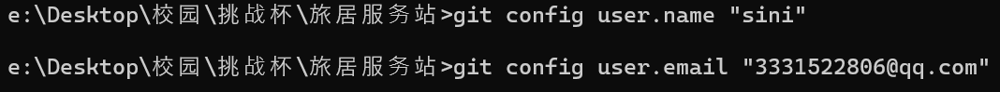

# GitHub 初始化指南

**项目**：旅居服务站  
**日期**：2026-02-16

---

## 一、准备工作

### 1.1 需要准备的内容

| 步骤 | 操作 | 说明 |
|------|------|------|
| ✅ | GitHub 账号 | 没有的话去 [github.com](https://github.com) 注册 |
| ✅ | Git 安装 | Windows 推荐安装 [Git for Windows](https://git-scm.com) |
| ✅ | 创建仓库 | 在 GitHub 网页上创建 |

### 1.2 Git for Windows 安装

1. 下载：[https://git-scm.com/download/win](https://git-scm.com/download/win)
2. 运行安装包，全部默认下一步
3. 安装完成后，在开始菜单找 **Git Bash**

---

## 二、GitHub 仓库创建

### 2.1 步骤

1. 登录 [GitHub](https://github.com)
2. 点击右上角 **+** → **New repository**
3. 填写信息：

```
Repository name: lvji-service-station
Description: 旅居服务站 - 乡村数字游民平台
✅ Private (私有) 或 Public (公开)
```

4. 点击 **Create repository**

### 2.2 创建后看到的页面

```
Quick setup — if you've done this kind of thing before
HTTPS: https://github.com/你的用户名/lvji-service-station.git
```

**复制这个 HTTPS 地址，后面要用**

---

## 三、本地初始化

### 3.1 打开 Git Bash

```
开始菜单 → Git → Git Bash
```

### 3.2 进入项目目录

```bash
cd "e:\Desktop\校园\挑战杯\旅居服务站"
```

### 3.3 初始化 Git

```bash
git init
```

### 3.4 配置用户名（只需一次）

```bash
git config user.name "你的名字"  sini
git config user.email "你的邮箱"  
```


### 3.5 创建 .gitignore 文件

项目根目录新建文件 `README.md`，然后执行：

```bash
git add .
```

> ⚠️ 注意：如果有 node_modules 等不需要提交的文件，先确保项目根目录有 .gitignore

---

## 四、推送流程（完整命令）

### 4.1 首次推送

```bash
# 1. 添加远程仓库（只执行一次）
git remote add origin https://github.com/你的用户名/lvji-service-station.git

# 2. 创建 main 分支
git branch -M main

# 3. 提交所有文件
git add .
git commit -m "feat: 初始项目 - 用户中心v1.2.1已完成"

# 4. 推送到 GitHub
git push -u origin main
```

### 4.2 刷新 GitHub 页面

刷新页面，你会看到所有文件已上传。

---

## 五、团队协作流程

### 5.1 邀请团队成员

1. 在 GitHub 仓库页面 → **Settings** → **Manage access**
2. 点击 **Invite a collaborator**
3. 输入成员的用户名或邮箱
4. 成员接受邀请

### 5.2 成员克隆仓库

```bash
# 成员执行
git clone https://github.com/你的用户名/lvji-service-station.git
```

### 5.3 开发流程

```bash
# 1. 拉取最新代码
git checkout main
git pull origin main

# 2. 创建功能分支
git checkout -b feature/民宿-api

# 3. 开发完成后提交
git add .
git commit -m "feat(house): 添加民宿列表API"

# 4. 推送到远程
git push origin feature/民宿-api

# 5. 在 GitHub 创建 Pull Request
# 网页操作：仓库页面 → Pull requests → New pull request
```

### 5.4 主干线更新

```bash
# 每天工作前
git checkout main
git pull origin main
```

---

## 六、常见问题

### Q1：push 时要输入用户名密码？

推荐使用 **Personal Access Token**：

1. GitHub → Settings → Developer settings → Personal access tokens
2. Generate new token (Classic)
3. 勾选 `repo` 权限
4. 生成后复制 token
5. 密码栏输入 token 而非 GitHub 密码

### Q2：文件修改后想撤销？

```bash
# 撤销单个文件
git checkout -- 文件名

# 撤销所有修改
git checkout -- .

# 彻底删除未提交的修改（谨慎使用）
git clean -fd
```

### Q3：想查看提交历史？

```bash
git log --oneline --graph --all
```

### Q4：分支合并冲突？

1. `git pull origin main` 拉取最新
2. 手动解决冲突（保留需要的代码）
3. `git add .` → `git commit` → `git push`

---

## 七、目录结构建议

```
旅居服务站/
├── .gitignore              # Git忽略配置
├── README.md               # 项目说明
├── package.json
├── vite.config.js
│
├── src/                    # 源代码（如果需要拆分）
│   ├── frontend/           # 前端代码
│   └── backend/            # 后端代码（后续）
│
└── docs/                   # 文档
    ├── 01-设计规范/
    ├── 02-项目管理/
    ├── 03-项目规划/
    ├── 04-更新记录/
    ├── 05-功能设计/
    ├── 06-API设计/
    └── 07-团队协作/
```

---

## 八、下一步

| 步骤 | 操作人 | 说明 |
|------|--------|------|
| 1 | 你 | 注册/登录 GitHub |
| 2 | 你 | 创建仓库（Lvji-service-station） |
| 3 | 我 | 初始化本地 Git |
| 4 | 你 | 邀请团队成员 |
| 5 | 团队 | 各自克隆开发 |

---

## 九、验证清单

- [ ] GitHub 账号已注册
- [ ] Git for Windows 已安装
- [ ] 仓库已创建
- [ ] 本地已初始化
- [ ] 首次代码已推送
- [ ] 团队成员已加入
