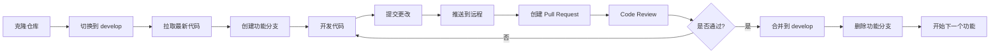

# 克隆其他模块前端代码指南

**项目名称**：旅居服务站  
**仓库地址**：https://github.com/BuBaiZhi/lvji-service-station  
**创建日期**：2026-02-25

---

## 📋 目录

1. [前置准备](#一前置准备)
2. [克隆仓库](#二克隆仓库)
3. [查看可用模块](#三查看可用模块)
4. [切换到目标分支](#四切换到目标分支)
5. [合并其他模块代码](#五合并其他模块代码)
6. [解决可能的冲突](#六解决可能的冲突)
7. [常见问题与解决方案](#七常见问题与解决方案)
8. [完整操作示例](#八完整操作示例)

---

## 一、前置准备

### 1.1 环境检查

确保你的开发环境已经安装以下工具：

```bash
# 检查 Git 是否已安装
git --version
# 应显示：git version 2.x.x

# 检查 Node.js 是否已安装（如果需要）
node --version
# 应显示：v14.x.x 或更高

# 检查 npm 是否已安装（如果需要）
npm --version
# 应显示：6.x.x 或更高
```

### 1.2 配置 Git 用户信息

如果是首次使用 Git，需要配置用户信息：

```bash
# 配置用户名
git config --global user.name "你的名字"

# 配置邮箱
git config --global user.email "你的邮箱@example.com"

# 配置行尾符自动转换（Windows 用户推荐）
git config --global core.autocrlf true
```

### 1.3 获取仓库访问权限

- 确保你的 GitHub 账号已经被添加为仓库的协作者
- 如果没有权限，请联系仓库管理员（BuBaiZhi）添加

---

## 二、克隆仓库

### 2.1 选择克隆位置

选择一个合适的目录来存放项目代码：

```bash
# 示例：进入桌面目录
cd D:\Desktop\校园\挑战杯

# 或者选择其他位置
# cd D:\Projects
```

### 2.2 克隆仓库

使用以下命令克隆仓库到本地：

```bash
# HTTPS 方式（推荐，无需配置 SSH）
git clone https://github.com/BuBaiZhi/lvji-service-station.git

# 或者使用 SSH 方式（需要提前配置 SSH Key）
git clone git@github.com:BuBaiZhi/lvji-service-station.git
```

**预期输出**：
```
Cloning into 'lvji-service-station'...
remote: Enumerating objects: 100, done.
remote: Counting objects: 100% (100/100), done.
remote: Compressing objects: 100% (80/80), done.
Receiving objects: 100% (100/100), 1.23 MiB | 2.50 MiB/s, done.
Resolving deltas: 100% (50/50), done.
```

### 2.3 进入项目目录

```bash
cd lvji-service-station
```

### 2.4 查看当前状态

```bash
# 查看当前分支
git branch
# 应显示：* main（或 master）

# 查看远程分支
git branch -r
# 应显示所有远程分支列表

# 查看所有分支（本地 + 远程）
git branch -a
```

---

## 三、查看可用模块

### 3.1 查看远程分支列表

根据项目的分支策略，不同的模块存放在不同的功能分支中：

```bash
# 查看所有远程分支
git branch -r

# 预期输出示例：
#   origin/main
#   origin/develop
#   origin/feature/user-center         ✅ 用户中心（已完成）
#   origin/feature/house-api          🔄 民宿模块（开发中）
#   origin/feature/skill-api          🔄 技能模块（开发中）
#   origin/feature/activity-api       🔄 活动模块（开发中）
#   origin/feature/square-api         🔄 广场模块（开发中）
#   origin/feature/message-api        🔄 消息模块（开发中）
```

### 3.2 模块与分支对应关系

| 模块名称 | 分支名称 | 状态 | 说明 |
|---------|---------|------|------|
| 用户中心 | `feature/user-center` | ✅ 已完成 | 用户资料、设置、交易记录等 |
| 民宿模块 | `feature/house-api` | 🔄 开发中 | 房源发布、预订、评价 |
| 技能模块 | `feature/skill-api` | 🔄 开发中 | 技能发布、需求对接 |
| 活动模块 | `feature/activity-api` | 🔄 开发中 | 活动发布、报名管理 |
| 广场模块 | `feature/square-api` | 🔄 开发中 | 社区动态、交流讨论 |
| 消息模块 | `feature/message-api` | 🔄 开发中 | 实时通知、对话管理 |
| 主开发线 | `develop` | ⭐ 最新 | 集成所有已完成的功能 |

### 3.3 查看分支详细信息

```bash
# 查看某个分支的最新提交信息
git log origin/feature/house-api --oneline -5

# 查看某个分支的文件列表
git ls-tree -r --name-only origin/feature/house-api
```

---

## 四、切换到目标分支

### 4.1 拉取最新的 develop 分支

推荐先拉取 `develop` 分支，它包含了所有已完成且通过审查的功能：

```bash
# 方法一：直接切换到 develop 分支
git checkout develop

# Git 会自动创建本地 develop 分支并关联到 origin/develop
```

**预期输出**：
```
Branch 'develop' set up to track remote branch 'develop' from 'origin'.
Switched to a new branch 'develop'
```

### 4.2 拉取最新代码

```bash
# 确保 develop 分支是最新的
git pull origin develop
```

**预期输出**：
```
Already up to date.
# 或者
Updating 1234567..abcdefg
Fast-forward
 旅居服务站-mini/pages/house/index.js | 100 +++++++++++++++++++++++
 1 file changed, 100 insertions(+)
```

### 4.3 切换到特定功能分支（可选）

如果你想查看某个正在开发中的功能分支：

```bash
# 切换到民宿模块分支
git checkout feature/house-api

# 或者切换到技能模块分支
git checkout feature/skill-api

# 或者切换到活动模块分支
git checkout feature/activity-api

# 或者切换到广场模块分支
git checkout feature/square-api

# 或者切换到消息模块分支
git checkout feature/message-api
```

---

## 五、合并其他模块代码

### 5.1 场景说明

如果你已经在本地开发了一部分代码，现在想要将其他模块的代码合并到你的项目中，可以使用以下方法：

### 5.2 方法一：合并到当前分支

```bash
# 1. 确保你在自己的分支上
git checkout feature/your-feature-name

# 2. 拉取最新的 develop
git pull origin develop

# 3. 合并 develop 到你的分支
git merge develop

# 4. 如果有冲突，解决冲突后提交
git add .
git commit -m "merge: 合并 develop 到 feature/your-feature-name"
```

### 5.3 方法二：创建新的功能分支

如果你想基于 develop 创建新的分支进行开发：

```bash
# 1. 切换到 develop 分支
git checkout develop

# 2. 拉取最新代码
git pull origin develop

# 3. 基于 develop 创建新分支
git checkout -b feature/your-new-feature

# 4. 开始开发
# ...编写代码...

# 5. 提交更改
git add .
git commit -m "feat: 添加新功能描述"

# 6. 推送到远程
git push origin feature/your-new-feature
```

### 5.4 方法三：Cherry-pick 特定提交

如果你只想要某个分支的某几个提交：

```bash
# 1. 查看目标分支的提交历史
git log origin/feature/house-api --oneline -10

# 2. 复制你需要的 commit hash（例如：abc1234）

# 3. Cherry-pick 该提交到当前分支
git cherry-pick abc1234

# 4. 如果有冲突，解决冲突后继续
git add .
git cherry-pick --continue
```

---

## 六、解决可能的冲突

### 6.1 什么是冲突？

当两个分支修改了同一文件的同一行代码时，Git 无法自动合并，就会产生冲突。

### 6.2 冲突的标记

Git 会在冲突的文件中插入标记：

```javascript
<<<<<<< HEAD
// 你的代码
const userName = 'Alice';
=======
// 其他分支的代码
const userName = 'Bob';
>>>>>>> feature/house-api
```

### 6.3 解决冲突的步骤

**步骤 1：查看冲突文件**

```bash
# 查看有冲突的文件列表
git status

# 预期输出：
# Unmerged paths:
#   both modified:   旅居服务站-mini/pages/index/index.js
```

**步骤 2：打开冲突文件**

使用 HBuilder X 或其他编辑器打开冲突文件，你会看到类似这样的标记：

```javascript
<<<<<<< HEAD
// 当前分支的代码
const theme = 'light';
=======
// 要合并的分支的代码
const theme = 'dark';
>>>>>>> develop
```

**步骤 3：手动选择保留的代码**

有三种选择：
1. **保留当前分支的代码**：删除 `=======` 到 `>>>>>>>` 之间的内容和所有标记
2. **保留要合并分支的代码**：删除 `<<<<<<<` 到 `=======` 之间的内容和所有标记
3. **同时保留两者**：根据逻辑整合两部分代码，删除所有标记

示例（同时保留两者）：
```javascript
// 整合后的代码
const theme = wx.getStorageSync('theme') || 'light';
```

**步骤 4：标记冲突已解决**

```bash
# 添加已解决的文件
git add 旅居服务站-mini/pages/index/index.js

# 如果还有其他冲突文件，继续解决并添加
```

**步骤 5：完成合并**

```bash
# 提交合并结果
git commit -m "fix: 解决合并冲突"

# 推送到远程
git push origin feature/your-feature-name
```

### 6.4 使用 IDE 工具解决冲突

HBuilder X 和 Visual Studio Code 都提供了可视化的冲突解决工具：

**HBuilder X**：
1. 打开有冲突的文件
2. 在冲突标记处会显示 "接受当前更改" | "接受传入更改" | "接受双方更改"
3. 点击相应按钮即可自动处理冲突

**Visual Studio Code**：
1. 打开有冲突的文件
2. 在冲突标记上方会显示操作按钮
3. 点击 "Accept Current Change" | "Accept Incoming Change" | "Accept Both Changes"

---

## 七、常见问题与解决方案

### Q1：克隆时提示权限不足？

**问题**：
```
fatal: Authentication failed for 'https://github.com/BuBaiZhi/lvji-service-station.git/'
```

**解决方案**：
1. 确认你的 GitHub 账号已被添加为协作者
2. 使用 HTTPS 方式克隆时，需要输入 GitHub 用户名和密码（或 Personal Access Token）
3. 如果启用了两步验证，需要使用 Personal Access Token 代替密码

**生成 Personal Access Token**：
1. 登录 GitHub → Settings → Developer settings → Personal access tokens
2. Generate new token → 选择权限（至少需要 `repo`）
3. 复制生成的 token（只显示一次）
4. 克隆时使用 token 作为密码

### Q2：切换分支时提示有未提交的更改？

**问题**：
```
error: Your local changes to the following files would be overwritten by checkout:
        旅居服务站-mini/pages/index/index.js
Please commit your changes or stash them before you switch branches.
```

**解决方案一：提交更改**
```bash
git add .
git commit -m "feat: 保存当前进度"
git checkout develop
```

**解决方案二：暂存更改**
```bash
# 暂存当前更改
git stash

# 切换分支
git checkout develop

# 恢复暂存的更改（如需要）
git stash pop
```

### Q3：拉取代码时提示冲突？

**问题**：
```
error: Your local changes to the following files would be overwritten by merge:
        旅居服务站-mini/app.js
Please commit your changes or stash them before you merge.
```

**解决方案**：
参考 [Q2 的解决方案](#q2切换分支时提示有未提交的更改)

### Q4：如何查看某个文件的修改历史？

```bash
# 查看文件的提交历史
git log --oneline 旅居服务站-mini/pages/index/index.js

# 查看文件的详细修改记录
git log -p 旅居服务站-mini/pages/index/index.js

# 查看文件在某个提交中的内容
git show commit-hash:旅居服务站-mini/pages/index/index.js
```

### Q5：如何撤销本地的更改？

```bash
# 撤销工作区的更改（未 add）
git checkout -- 旅居服务站-mini/pages/index/index.js

# 撤销暂存区的更改（已 add，未 commit）
git reset HEAD 旅居服务站-mini/pages/index/index.js

# 撤销最后一次提交（保留更改）
git reset --soft HEAD~1

# 撤销最后一次提交（丢弃更改）
git reset --hard HEAD~1
```

### Q6：如何只获取特定文件夹的代码？

**问题**：只想要某个模块的前端代码，不想克隆整个仓库

**解决方案**：Git 不支持部分克隆，但可以使用以下方法：

```bash
# 方法一：克隆后只保留需要的文件夹
git clone https://github.com/BuBaiZhi/lvji-service-station.git
cd lvji-service-station
# 手动复制需要的文件夹到其他位置

# 方法二：使用 sparse-checkout（Git 2.25+）
git clone --filter=blob:none --no-checkout https://github.com/BuBaiZhi/lvji-service-station.git
cd lvji-service-station
git sparse-checkout init --cone
git sparse-checkout set 旅居服务站-mini/pages/house
git checkout
```

### Q7：如何对比两个分支的差异？

```bash
# 查看两个分支的文件差异列表
git diff develop..feature/house-api --name-only

# 查看两个分支的详细差异
git diff develop..feature/house-api

# 查看某个文件在两个分支的差异
git diff develop..feature/house-api -- 旅居服务站-mini/pages/house/index.js
```

---

## 八、完整操作示例

### 8.1 场景一：从零开始克隆并使用 develop 分支

```bash
# 1. 进入工作目录
cd D:\Desktop\校园\挑战杯

# 2. 克隆仓库
git clone https://github.com/BuBaiZhi/lvji-service-station.git

# 3. 进入项目目录
cd lvji-service-station

# 4. 切换到 develop 分支
git checkout develop

# 5. 拉取最新代码
git pull origin develop

# 6. 查看项目结构
ls -R 旅居服务站-mini/pages

# 7. 开始开发
# ...在 HBuilder X 中打开项目...
```

### 8.2 场景二：基于 develop 创建新功能分支

```bash
# 1. 确保在 develop 分支
git checkout develop

# 2. 拉取最新代码
git pull origin develop

# 3. 创建新的功能分支
git checkout -b feature/house-frontend

# 4. 开发代码
# ...编写代码...

# 5. 提交更改
git add .
git commit -m "feat(house): 添加民宿列表页面"

# 6. 推送到远程
git push origin feature/house-frontend

# 7. 在 GitHub 上创建 Pull Request
# 访问：https://github.com/BuBaiZhi/lvji-service-station/pulls
# 点击 "New pull request"
# Base: develop, Compare: feature/house-frontend
```

### 8.3 场景三：合并其他成员的代码到自己的分支

```bash
# 1. 确保在自己的分支
git checkout feature/your-feature

# 2. 查看当前状态
git status

# 3. 拉取最新的 develop
git fetch origin

# 4. 合并 develop 到当前分支
git merge origin/develop

# 5. 如果有冲突，解决冲突
# ...在 IDE 中解决冲突...
git add .
git commit -m "merge: 合并 develop 最新代码"

# 6. 推送到远程
git push origin feature/your-feature
```

### 8.4 场景四：只复制特定模块的代码到现有项目

```bash
# 假设你已经有一个本地项目，想要复制民宿模块的代码

# 1. 在临时目录克隆仓库
cd D:\Temp
git clone https://github.com/BuBaiZhi/lvji-service-station.git
cd lvji-service-station

# 2. 切换到包含民宿模块的分支
git checkout feature/house-api

# 3. 复制需要的文件到你的项目
# 手动复制 旅居服务站-mini/pages/house 到你的项目中
# 或者使用命令：
xcopy /E /I "旅居服务站-mini\pages\house" "D:\Desktop\校园\挑战杯\旅居服务站\旅居服务站-mini\pages\house"

# 4. 复制相关的配置和服务文件（如需要）
xcopy "旅居服务站-mini\services\house.js" "D:\Desktop\校园\挑战杯\旅居服务站\旅居服务站-mini\services\house.js"

# 5. 清理临时目录
cd ..
rmdir /S /Q lvji-service-station
```

---

## 九、最佳实践建议

### 9.1 ✅ 推荐的做法

1. **每天拉取最新代码**
   ```bash
   git checkout develop
   git pull origin develop
   ```

2. **基于最新的 develop 创建功能分支**
   ```bash
   git checkout develop
   git pull origin develop
   git checkout -b feature/your-feature
   ```

3. **经常提交，保持提交粒度适中**
   ```bash
   # 好的提交：单一功能
   git commit -m "feat(house): 添加房源列表组件"
   
   # 避免：多个不相关的更改
   git commit -m "修改了很多东西"
   ```

4. **在合并前先同步 develop**
   ```bash
   git checkout feature/your-feature
   git merge origin/develop
   # 解决冲突
   git push origin feature/your-feature
   ```

### 9.2 ❌ 应该避免的做法

1. **❌ 直接在 main 或 develop 上开发**
   ```bash
   # 错误示例
   git checkout main
   # ...直接修改代码...
   git commit -m "修改"
   ```

2. **❌ 长期不合并的分支**
   - 避免功能分支存在超过 2 周
   - 定期合并 develop 到你的分支

3. **❌ 提交敏感信息**
   - 不要提交密码、API 密钥
   - 不要提交 `.env` 文件（应该在 `.gitignore` 中）

4. **❌ 提交生成文件**
   - 不要提交 `node_modules/`
   - 不要提交 `dist/`、`build/` 等编译输出

### 9.3 📝 提交信息规范

遵循 Conventional Commits 规范：

```
<type>(<scope>): <subject>

<body>

<footer>
```

**type 类型**：
- `feat`: 新功能
- `fix`: 修复 bug
- `docs`: 文档更新
- `style`: 代码格式（不影响功能）
- `refactor`: 重构
- `test`: 测试
- `chore`: 构建、依赖更新

**示例**：
```bash
git commit -m "feat(house): 添加民宿列表页面

- 实现分页加载
- 添加筛选功能
- 集成图片懒加载"
```

---

## 十、快速参考卡

### 常用命令速查表

| 操作 | 命令 |
|------|------|
| 克隆仓库 | `git clone https://github.com/BuBaiZhi/lvji-service-station.git` |
| 查看分支 | `git branch -a` |
| 切换分支 | `git checkout develop` |
| 创建新分支 | `git checkout -b feature/your-feature` |
| 拉取最新代码 | `git pull origin develop` |
| 查看状态 | `git status` |
| 添加文件 | `git add .` |
| 提交更改 | `git commit -m "feat: 描述"` |
| 推送代码 | `git push origin feature/your-feature` |
| 合并分支 | `git merge develop` |
| 查看历史 | `git log --oneline -10` |
| 解决冲突 | `git add . && git commit` |

### 分支对应关系速查

| 想要的模块 | 切换到的分支 |
|-----------|-------------|
| 所有已完成功能 | `develop` |
| 用户中心 | `feature/user-center` |
| 民宿模块 | `feature/house-api` |
| 技能模块 | `feature/skill-api` |
| 活动模块 | `feature/activity-api` |
| 广场模块 | `feature/square-api` |
| 消息模块 | `feature/message-api` |

---

## 十一、进阶技巧

### 11.1 使用别名简化命令

在 Git 配置中添加别名：

```bash
# 配置别名
git config --global alias.st status
git config --global alias.co checkout
git config --global alias.br branch
git config --global alias.cm commit
git config --global alias.lg "log --oneline --graph --all"

# 使用别名
git st        # 等同于 git status
git co develop # 等同于 git checkout develop
git lg        # 美化的提交历史
```

### 11.2 使用 .gitignore 忽略文件

确保项目根目录有 `.gitignore` 文件：

```bash
# 查看 .gitignore
cat .gitignore

# 示例内容
node_modules/
dist/
.env
.DS_Store
*.log
unpackage/
```

### 11.3 使用 Git Stash 管理临时更改

```bash
# 暂存当前更改
git stash

# 查看暂存列表
git stash list

# 应用最新的暂存
git stash pop

# 应用特定的暂存
git stash apply stash@{0}

# 删除暂存
git stash drop stash@{0}

# 清空所有暂存
git stash clear
```

### 11.4 使用 Git Tags 标记版本

```bash
# 创建标签
git tag v1.0.0

# 推送标签到远程
git push origin v1.0.0

# 查看所有标签
git tag -l

# 切换到某个标签
git checkout v1.0.0
```

---

## 十二、团队协作流程

### 12.1 完整的开发流程



### 12.2 PR 审查清单

在创建 Pull Request 前，确保：

- [ ] 代码遵循项目规范
- [ ] 所有新功能都有注释
- [ ] 删除了 console.log 调试代码
- [ ] 测试通过（如有）
- [ ] 没有提交敏感信息
- [ ] commit message 清晰明确
- [ ] 已解决所有冲突
- [ ] PR 描述详细说明了更改内容

---

## 十三、获取帮助

### 相关文档

- **[GitHub 团队协作指南](./GitHub团队协作指南.md)** - 完整的团队协作流程
- **[新成员快速开始](./新成员快速开始.md)** - 新成员入门指南
- **[GitHub 初始化指南](./GitHub初始化指南.md)** - 仓库初始化说明

### 遇到问题？

1. 📋 查看 [GitHub 团队协作指南](./GitHub团队协作指南.md) 的常见问题章节
2. 🔍 搜索 GitHub Issues：https://github.com/BuBaiZhi/lvji-service-station/issues
3. 💬 在项目讨论区提问
4. 📧 联系项目维护者

---

**最后更新**：2026-02-25  
**文档版本**：v1.0.0  
**维护者**：项目团队

---

**⭐ 提示**：将此文档加入浏览器书签，方便随时查阅！
